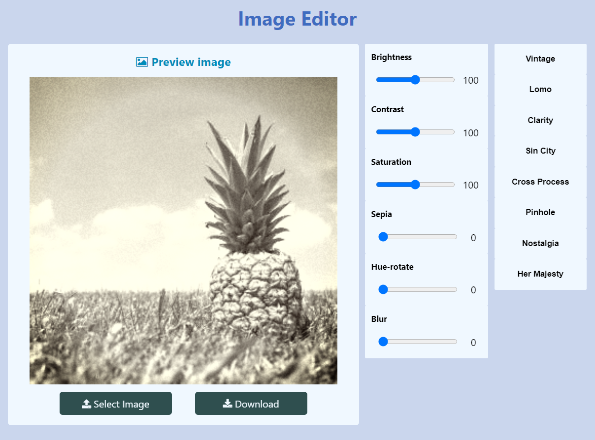

# Image-Editor
Mini image editor using CamanJS

#### What is CamanJS?
[CamanJS](http://camanjs.com/) is (ca)nvas (man)ipulation in Javascript. It's a combination of a simple-to-use interface with advanced and efficient image/canvas editing techniques.

#### Usage
##### Javascript
<code>Caman('#my-image', function () {
    this.brightness(10);
    this.contrast(30);
    this.sepia(60);
    this.saturation(-30);
    this.render();
  });</code>

##### HTML data attribute
<code>
</code>
 
#### Screenshot:

